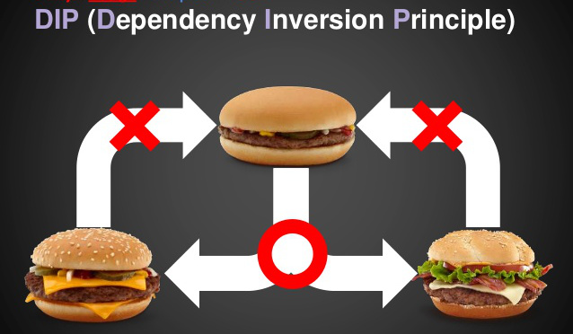

## Dependency Inversion Principle



> Entities must depend on abstractions not on concretions. It states that the high level module must not depend on the low level module, but they should depend on abstractions.

As a dynamic language, JavaScript doesn’t require the use of abstractions to facilitate decoupling. Therefore, the stipulation that abstractions shouldn’t depend upon details isn’t particularly relevant to JavaScript applications. The stipulation that high level modules shouldn’t depend upon low level modules is, however, relevant.

```javascript
class Person {
    sendReport() {
        const report = new Reporter();
        report.sendReport();
    }
    // another methonds
}
```
The main object in our business logic is Reporter.

```javascript
class Reporter {
    sendReport() {
        const reportBuilder = new ReportBuilder();
        const reports = reportBuilder.createReports();

        const reportSender = new EmailReportSender();
        reports.forEach(report => reportSender.send(report));

    }
    // another methonds
}
```

Are there any problems with this code?

#### Connectedness

The fact is that the function SendReports, in addition to its direct duty, knows too much and knows how:

1. knows that it is ReportBuilder that will generate reports
2. knows that all reports must be sent via email using EmailReportSender
3. can create a ReportBuilder object
4. can create an EmailReportSender object

In addition, the first points violate the principle of openness / closure. The fact is that if we want to send messages via SMS using our utility, we will have to change the code of the Reporter class. Instead of EmailReportSender we will have to write SmsReportSender. Even more difficult is the situation when one part of the users of the Reporter class wants to send messages via emal, and the second via SMS.

### We apply the principle of inversion of dependencies

```javascript
class ServiceLocator {
    constructor(ReportBuilder, ReportSender) {
        this.reportBuilder =  new ReportBuilder();
        this.reportSender = new ReportSender;
    }
}
```

```javascript
class Reporter {
    constructor() {
        this.reportBuilder = ServiceLocator.reportBuilder;
        this.reportSender = ServiceLocator.reportSender;
    }
    sendReport() {
        const reports = reportBuilder.createReports();
        reports.forEach(report => this.reportSender.send(report));
    }
}
```
After initializing ServiceLocator, we call an empty constructor anywhere in the program:

```javascript
    const reporter = new Reporter(); 
    reporter.SendReports();  
```

Now objects only know about the interfaces of classes that they interact with