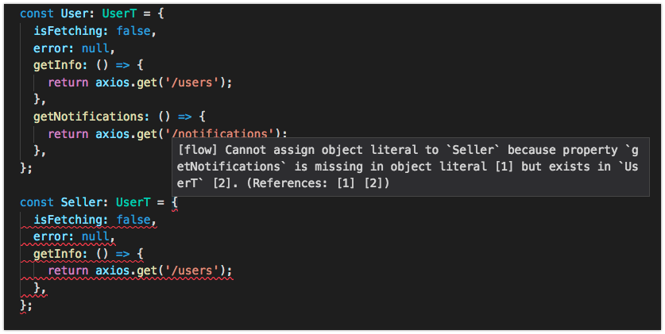

## Interface segregation Principle


> Entities must depend on abstractions not on concretions. It states that the high level module must not depend on the low level module, but they should depend on abstractions.

Let us consider an example from life using flow. This, of course, is not copied code one to one, but very close to what it was. There is a base class User

```javascript
type UsersData = {
  data: Array<Object>,
};

type UserT = {|
  isFetching: boolean,
  error: ?string,
  getInfo: () => UsersData,
|};

const User: UserT = {
  isFetching: false,
  error: null,
  getInfo: () => {
    return axios.get('/users');
  },
};
```
After that, we begin to implement the heirs. For example, create Seller class:

```javascript
const Seller: UserT = {
  isFetching: false,
  error: null,
  getInfo: () => {
    return axios.get('/users');
  },
};
```
Now the addition of heirs does not interfere. Now let us imagine that User class need in new method "getRoles". 

```javascript
type NotificationsData = {
  data: Array<Object>,
};

type UserT = {|
  isFetching: boolean,
  error: ?string,
  getInfo: () => UsersData,
  getNotifications: () => NotificationsData,
|};

const User: UserT = {
  isFetching: false,
  error: null,
  getInfo: () => {
    return axios.get('/users');
  },
  getNotifications: () => {
    return axios.get('/notifications');
  },
};
```

This method is also abstract and requires implementation in successors.



```javascript
const Seller: UserT = {
  isFetching: false,
  error: null,
  getInfo: () => {
    return axios.get('/users');
  },
  getNotifications: () => {
    // this method unused
  },
};
```

And the more the chain of dependencies, the more unused interfaces will accumulate.We need to separate the interfaces.


[ Prev (Liskov’s Substitution Principle Principle)](./LS.md)
[ Next (Dependency inversion principle)](./DI.md)