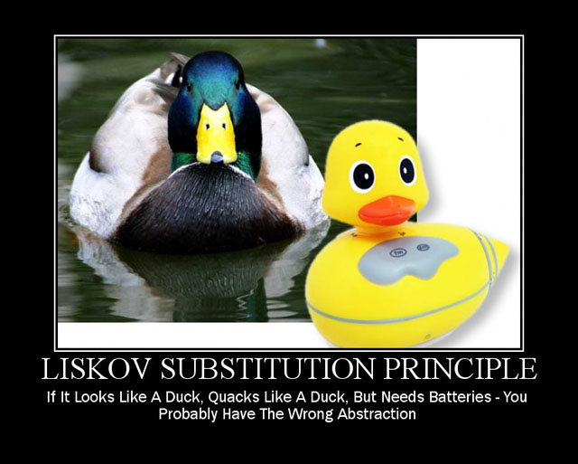

## Liskov’s Substitution Principle



> Let q(x) be a property provable about objects of x of type T. Then q(y) should be provable for objects y of type S where S is a subtype of T.

or 

> A derived class must never break the definition of a parent class.

In other words, a subclass should override the parent class methods in a way that does not break functionality from a client’s point of view.

For example, we have News class that shows some news

```javascript 
    class News {
        getInfo() {
            return axios.get('/news'); // return {..., data: news: [...]}
        }
    }
```
and we have News class for sellers: 

```javascript
    class SellerNews extends News {    
        getInfo() {
            return axios.get('/sellersNews');
        }

        // we can add another methods
    }
```
In both classes we use the  "getInfo" method. If we use any of these classes to receive news, everything will work for us. We do't change the functionality, and nothing will be broken.

We have Notification classs that must show users notifications. 

```javascript
    class Notification extends News {    
        getInfo() {
            const notifications = [];
            const response = axios.get('/notifications');

            response.notifications.map(n => {
                setTimeOut(() => {
                    this.showNotification(n);
                }, 4000)
            });
        }
        showNotification(data) {
            // show notification
        }
    }
```

In this case, if we use this class to receive news or some data, our application will break. We will call the "getInfo" function like all News children, and expect an object with data, but it's function returned undefined. In this case we violate the Liscov's substitution principle.


[ Prev (Open Closed Principle)](./OC.md)
[ Next (Interface segregation Principle)](./LS.md)